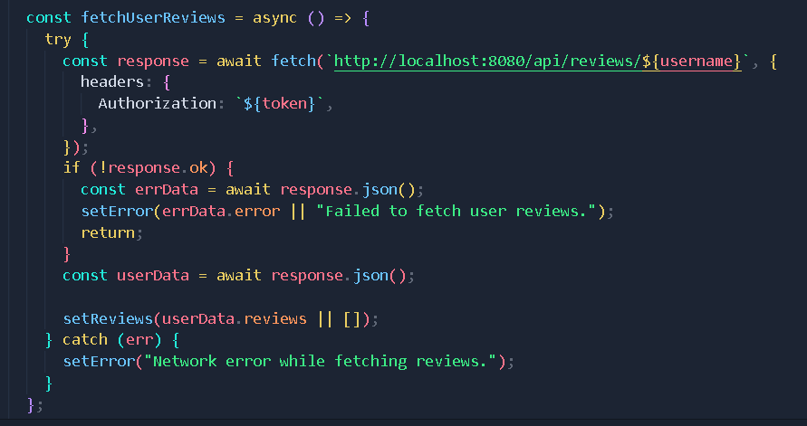
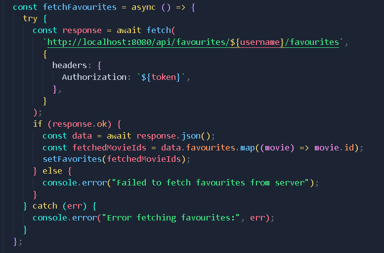
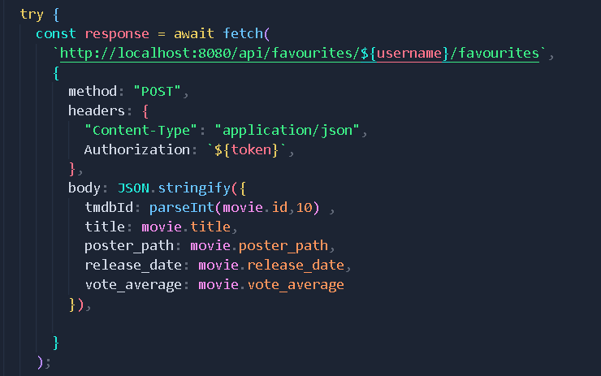
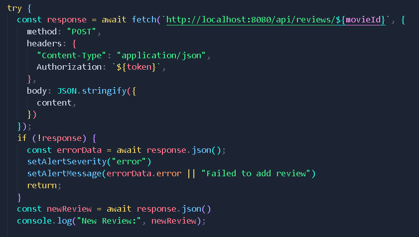

# Assignment 2 - Web API.

Name: Zixin Wang

## Features.

A bullet-point list of the ADDITIONAL features you have implemented in the API **THAT WERE NOT IN THE LABS** (or modifications to existing features)
 
 + Exit function, clear local token and username
 + Avatar function, named after the user's initials, and can change color randomly
 + View user's own comments

## Setup requirements.

You need to enter cd movies-api and react-movies then run npm run start and npm start seperately.

## API Configuration
In /movies-api/.env
______________________
NODE_ENV=development
PORT=8080
HOST=localhost
mongo_DB=YourMongoURL
TMDB_KEY=YourTMDBKEY
secret=YourJWTSecret
______________________

In /react-movies/.env
______________________
REACT_APP_TMDB_KEY=YourTMDBKEY
FAST_REFRESH=false
______________________       

## API Design
Give an overview of your web API design, perhaps similar to the following: 

- /api/movies | GET | Gets a list of movies 
- /api/movies/{movieid} | GET | Gets a single movie details
- /api/movies/tmdb/genres | GET | Gets tmdb genres
- /api/movies/tmdb/nowplaying | GET | Gets nowplaying movies
- /api/movies/tmdb/popularmovies | GET | Gets popular movies
- /api/movies/tmdb/trendingmovies/{timeWindow} | GET | Gets trending movies
- /api/movies/tmdb/person/{personId}/combinedcredits | GET | Gets person's combined credits
- /api/movies/tmdb/{id}/credits | GET | Gets movies' credits
- /api/movies/tmdb/{id}/recommendations | GET | Gets movie's recommendations movies
- /api/movies/tmdb/{id}/reviews | GET | Gets movie's reviews

- /api/users | GET | Gets a list of users
- /api/users/{id} | GET | Gets a single user details
- /api/users?action=login | POST | Logins a user
- /api/users?action=register | POST | Regists a user
- /api/users/{id} | PUT | Deletes a user

- /api/favourites/{username}/favourites | GET | Gets user's favourite movies details
- /api/favourites/{username}/favourites | POST | Add user's favourite movies

- /api/reviews | GET | Get all reviews
- /api/reviews/{id} | POST | Create a new review for Movie 
- /api/reviews/{username} | GET | Get all reviews of the user

## Security and Authentication

I have implemented authentication measures for all APIs starting with /api/movies, /api/reviews and /api/favourites. First, the authentication header is authenticated, and then the token is authenticated. Only after a successful login will there be a token. Then the token is decrypted, and then the information is searched in the database based on the username. The token is also encrypted with a specific key when logging in. In addition, all routes not included in my project will jump to the login page.And I added the logout function, which will clear the local token and username after logging out

## Integrating with React App

When dealing with the favorite API, every time a user clicks on a movie card, it will request the favorite API and store the data in the MongoDB database. In addition, every time a user adds a comment, it will also be stored in our database, and each user can also view their own comments.

## Independent learning (if relevant)

In this development, I used a lot of mui components such as Button to implement click interaction, Textfield to process user input of account, password and comments, Alert to handle success and error responses and table to present user comments. And I added the logout function and avatar to handle the logout problem.